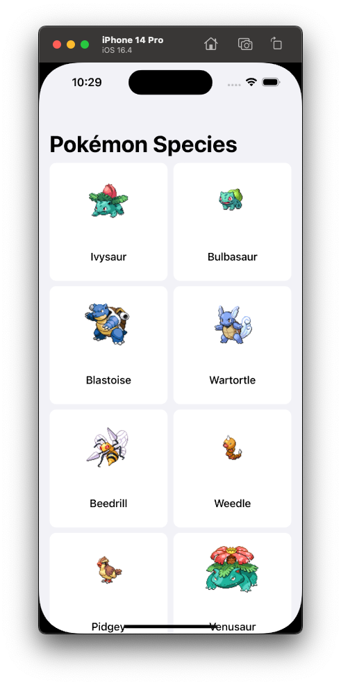
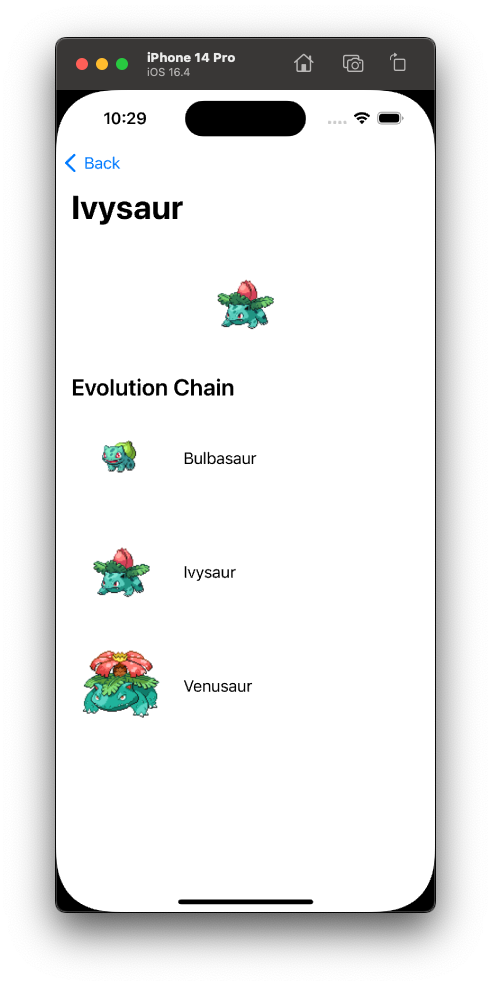
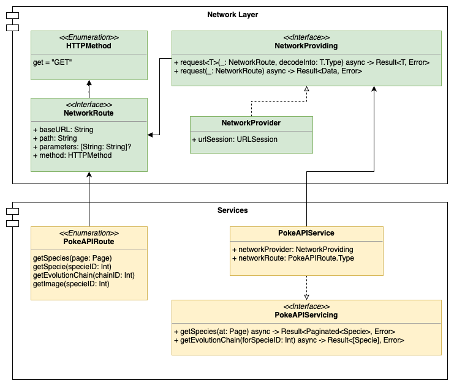

This is a simple iOS project developed for a tech-challenge.

The aim for this was to fetch a Pokemon list from an external source, with a paginated request being displayed in an infinite scroll list, and on tapping one of the Pokemons, display a detail screen with its evolution chain.

# Application

Pokemon Species             |  Pokemon Details
:-------------------------:|:-------------------------:
  |  

# Tech Stack

## Interfaces

Interfaces were built with UIKit, 100% manually coded, without the usage of any Storyboards or XIBs.

> This decision was made thinking on scalability, since in greater projects Storyboards can bring many conflicts issues in merge requests.

There's a simple code to enhance the readability of the constraints setting, making it as easy as:

```
private func setUpConstraints() {
    view.addSubviews(imageView, tableView)
    
    imageView
        .top(equalTo: view.safeAreaLayoutGuide.topAnchor, constant: 24)
        .centerX(equalTo: view.centerXAnchor)
    
    tableView
        .constraint(.leading, .trailing, .bottom, equalTo: view)
        .top(equalTo: imageView.bottomAnchor, constant: 24)
}
```

This was built on a `UIView` extension, no external dependencies were added for it.

## Network

No additional framework were added for networking. For scaling and reusability purposes, a custom network layer was built.



Since the application only made simple GET requests, it wouldn't make sense to add heavy networking frameworks. Instead of this, it was created a structure with Routers inspired on Moya's routing system, but without the need to rely on Alamofire.

Using async-await for handling the asynchronous requests made the networking as easy as:

```
let result = await pokeAPIService.getEvolutionChain(forSpecieID: specie.id)
```

## Strings

Strings in the application are localized. To avoid writing manually the localization identifiers in multiple places of the app, a `LocalizedString` enumeration was created and a custom initializer was added to `String`. 

With this simple structure, localization got as easy as:

```
title = String(LocalizedString.speciesListTitle)
```

## UI Design Pattern

The **MVP-C** was chosen as the UI Design Pattern since it's more fittable with the stack and provides enough isolation for unit testing.


## Unit Testing

**Quick & Nimble** were used for the Unit Testing, to provide a better readability for the test cases, and make errors also easier to understand due to the better messages.
